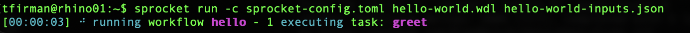

# Module 3: Running Workflows

> How to execute WDL workflows using Sprocket and PROOF — with the Hello World workflow from Module 2 as our hands-on example.

---

## Execution Engines Overview

While the WDL language describes the logistics of a particular workflow, an _execution engine_ is needed in order to actually carry out these instructions on a given computing platform. It essentially coordinates how and when to run each task throughout the workflow so you don't have to worry about it.

There are a few options available for folks to try out, but at Fred Hutch, we recommend one of two options: Sprocket (for direct execution on the command line) and PROOF (for more interactive point-and-click execution & monitoring).

## Sprocket (Command Line)

### What is Sprocket?

Sprocket is a command-line WDL executor originally developed by researchers over at St. Jude's. It's written in Rust, so it is fast and easy-to-install with lots of extra features already built in.

Cromwell and miniWDL are both reasonable options as well, but Cromwell requires a pretty complex installation/configuration in order to run workflows, and miniWDL is difficult to scale with larger HPC systems like the Fred Hutch cluster.

Plus, development of Sprocket is much more active compared to Cromwell and miniWDL, so if issues do come up, it's much more likely to be addressed in a timely fashion with Sprocket.

### Installing / Accessing Sprocket

When using the Fred Hutch cluster, installation isn't necessary, just load the pre-built Sprocket and Apptainer modules:

```
$ module load sprocket/0.19.0 Apptainer/1.1.6
$ sprocket --version
sprocket v0.19.0 (9b96d4f62 2025-11-24)
```

When running workflows directly on your laptop, it's straightforward to install Sprocket on Mac's via Homebrew (`brew install sprocket`) or on Windows via Cargo (`cargo install sprocket`), but other installation methods are available [in Sprocket's documentation](https://sprocket.bio/installation.html).

You'll also need to install Docker Desktop on your laptop to manage the underlying software environments, which can be downloaded through [Docker's website](https://www.docker.com/get-started/).

Once installed/loaded, Sprocket should behave relatively similarly no matter whether you're running on the cluster or locally.

> To follow along on the Fred Hutch cluster, copy the WDL script, input json, and config file to your current directory via the following commands
```
cp /fh/fast/_DaSL/public/hello-world.wdl .
cp /fh/fast/_DaSL/public/hello-world-inputs.json .
cp /fh/fast/_DaSL/public/sprocket-config.toml .
```

### Validating Before You Run

If you run `sprocket --help`, you'll notice a list of possible commands to utilize with Sprocket. The two main ones to focus on for this course are `lint` and `run`.

`sprocket run` does the actual execution of a WDL workflow, but a good first step before that is `sprocket lint`. This command validates that your workflow is properly formatted and identifies issues that might cause your workflow to exit prematurely during execution.

For instance, let's try validating the "Hello world" WDL we walked through in the previous section:

```
sprocket lint hello-world.wdl --hide-notes
```

You'll notice that nothing gets printed because our WDL is nicely-formatted and should run with no problem! 

> We're ignoring notes here as they have more to do with code cleanliness and best-practices, but if you're curious, feel free to remove the `--hide-notes` option and try it again.

However, let's pretend I forgot to finish the definition of the `greet` task by deleting the final `}` character at the end of the `hello-world.wdl` script. If we rerun the same `sprocket lint` command above, we now get an informative `error` message letting me know where I messed up:

```
error: expected `}`, but found end of input
   ┌─ docs/deep-dive/translational-data-science-series/building-computational-workflows/2026-winter/wdls/hello-world.wdl:65:1
   │
32 │ task greet {
   │            - this `{` is not matched
   ·
65 │ 
   │ ^ unexpected end of input

error: failing due to 1 error
```

The linting command can also provide less serious (but still important) `warning` messages that might break your workflow under certain conditions or make it less efficient/harder to use. Module 6 will touch more on other troubleshooting techniques, but workflow validation is your first line of defense. Before committing time & resources to executing your workflow (only to find out it's improperly formatted), you can identify potential issues immediately with `sprocket lint`.

### Running the Hello World Workflow with Sprocket

Now that we feel confident that our workflow will actually execute, let's take it for a spin using `sprocket run`! On a local laptop, the command is relatively straightforward in that we call `sprocket`, specify that it should `run` a workflow, point it to the location of the workflow script (`hello-world.wdl`), and provide it with input values via the inputs json (`hello-world-inputs.json`):

```
sprocket run hello-world.wdl hello-world-inputs.json
```

On the Fred Hutch cluster, it is a very similar and straightforward command, but we need to let Sprocket know that it's running on a shared HPC, so it should use SLURM & Apptainer when running tasks. To do this, we need to provide a two-line "configuration file" to Sprocket letting it know as such:

```
# The Slurm + Apptainer backend requires explicitly opting into experimental features.
run.experimental_features_enabled = true
# Set the default backend to Slurm + Apptainer.
run.backends.default.type = "slurm_apptainer"
```

From there, we can pass that config file to Sprocket using the `-c` option and pointing to the location of the file (in this case, a public copy available on Rhino):

```
sprocket run -c sprocket-config.toml hello-world.wdl hello-world-inputs.json
```

### Monitoring and Output

After running either of the commands above, you should see a status report displaying on the command line (see screenshot above) showing you what tasks are in progress, which tasks are completed, which tasks are still to come, and (hopefully not) which tasks have failed.



The "Hello World" workflow is relatively simple, so it should finish up within thirty seconds or so. Once it completes, you should see a list of your workflow outputs and where they are located:


If so, congratulations! You've just run your first workflow!!! :tada:

> For longer workflows with larger datasets on the Fred Hutch cluster, we recommend navigating to your lab's [`/hpc/temp/` directory](https://sciwiki.fredhutch.org/scicompannounce/2024-04-02-new-hpc-temp-storage/) and executing there to reduce storage costs for intermediate files. We also recommend utilizing [`grabnode`](https://sciwiki.fredhutch.org/compdemos/grabnode/) to isolate your Sprocket executor on its own node and reduce computational load on the head node of Rhino.

## PROOF (Point-and-Click)

### What is PROOF?

[PROOF](https://sciwiki.fredhutch.org/datascience/proof/) is a point-and-click app for submitting and monitoring WDL workflows on the Fred Hutch cluster. Developed by Fred Hutch OCDO, [PROOF](https://proof.fredhutch.org/) is a much better option for users that are less familiar with HPC-specific complexities like SLURM/grabnode/Apptainer, but would still like to harness the advantages of WDL workflows.

> Note: PROOF is only available to Fred Hutch users on the Fred Hutch network, but [Terra](https://terra.bio/) and [AnVIL](https://anvil.terra.bio/) provide similar functionality for users outside of Fred Hutch.

### Submitting the Hello World Workflow via PROOF

We recommend reviewing the [SciWiki "How to PROOF"](https://sciwiki.fredhutch.org/datademos/proof-how-to/) article for exact instructions on workflow submission and monitoring, but the general workflow is:

1. Navigate to [proof.fredhutch.org](https://proof.fredhutch.org/) on the Fred Hutch network.
2. Log in with your Fred Hutch credentials.
3. Launch a workflow scheduler via the "PROOF Server" tab.
4. Validate your workflow by uploading to script on the "Validate" tab.
5. On the "Submit Jobs" tab, upload your WDL script and customized inputs json and click "Submit" to execute the workflow on Rhino.
6. Head to the "Track Jobs" tab to monitor your workflow and locate your outputs when finished.

To troubleshoot a workflow in PROOF, we also recommend checking out the [PROOF Troubleshooting SciWiki article](https://sciwiki.fredhutch.org/datademos/proof-troubleshooting/) for tips & tricks.

## Choosing Between Sprocket and PROOF

For WDL-beginners at Fred Hutch, we recommend starting with PROOF for an easier introduction to computational workflows before jumping into the complexity of execution engines. That being said, if you'd like to dig further into WDL or your project has an extra level of complexity that requires execution from the command line, Sprocket is a great option for that, both at Fred Hutch and beyond!

---

**Previous:** [← WDL Concepts](02-wdl-concepts.md) | **Next:** [A Real-World Workflow →](04-real-world-workflow.md)
